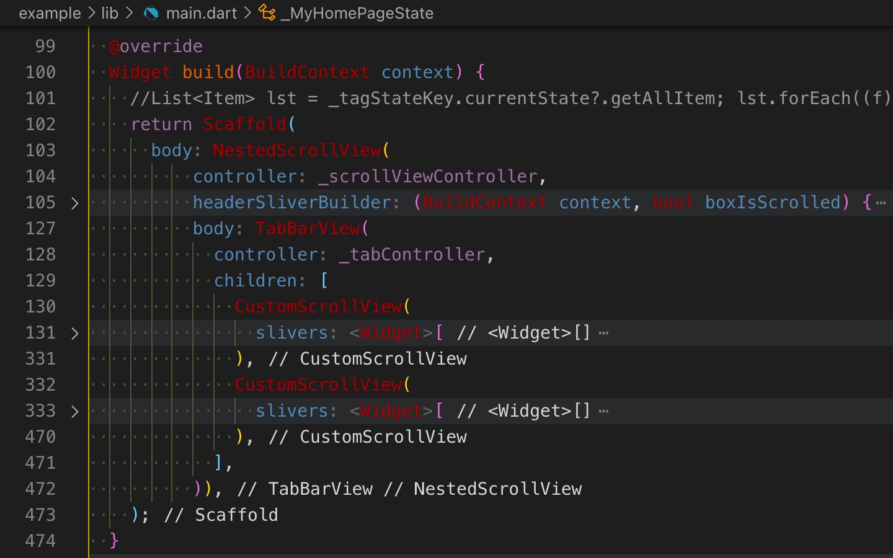
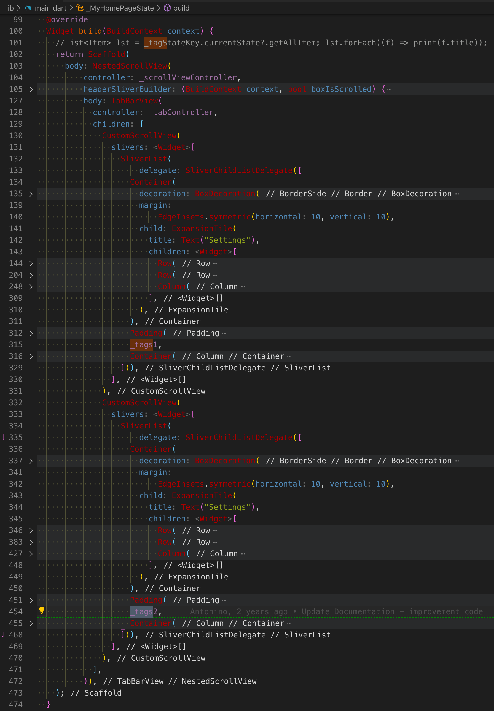

[TOC]

# flutter_tags

[flutter_tags](https://pub.dev/packages/flutter_tags)

## example

### initState

```Dart
// example/lib/main.dart

class _MyHomePageState extends State<MyHomePage>
    with SingleTickerProviderStateMixin {

  @override
  void initState() {
    super.initState();
    _tabController = TabController(length: 2, vsync: this);
    _scrollViewController = ScrollController();

    _items = _list.toList();
  }

  List _items;

  final GlobalKey<TagsState> _tagStateKey = GlobalKey<TagsState>();
```

### build

主 APP 脚手架 Scaffold 的 body 是一个 `NestedScrollView`，NestedScrollView 指定了：

- controller;  
- header;  
- body;  



#### headerSliverBuilder

NestedScrollView 的 header 部分是一个 `headerSliverBuilder` 函数，其中创建 SliverAppBar.bottom 为一个 TabBar，其标题为 Demo 1 和 Demo 2：

```Dart
          headerSliverBuilder: (BuildContext context, bool boxIsScrolled) {
            return <Widget>[
              SliverAppBar(
                title: Text("flutter tags"),
                centerTitle: true,
                pinned: true,
                expandedHeight: 0,
                floating: true,
                forceElevated: boxIsScrolled,
                bottom: TabBar(
                  isScrollable: false,
                  indicatorSize: TabBarIndicatorSize.label,
                  labelStyle: TextStyle(fontSize: 18.0),
                  tabs: [
                    Tab(text: "Demo 1"),
                    Tab(text: "Demo 2"),
                  ],
                  controller: _tabController,
                ),
              )
            ];
          },
```

#### body-TabBarView

NestedScrollView 的 body 部分是一个 `TabBarView`，指定了：

- controller;  
- children;  



##### tabController

点击 TabBarView.tabController，切换 TabBar.tabs（Demo 1 和 Demo 2），将切换 TabBarView.children 中的两个 `CustomScrollView`：

- CustomScrollView: Demo 1 = `Settings` + `_tags1`;  
- CustomScrollView: Demo 2 = `Settings` + `_tags2`;  

**CustomScrollView** 有以下子视图组成：

1. Container：设置下拉视图;  
2. Padding：上下间距;  
3. _tags1、_tags2：标签面板;  
4. Container：底部分隔线;  

##### Settings

Settings 是一个 `ExpansionTile`，可下拉展开或折叠其子视图。  
展开的子视图 children 是由两行（Row）一列（Column = Text + Row）构成。  

- `_buildItems`：Demo 1 中第一行的 Symmetry 排列方式下拉列表，选择一行的标签数量_column；  
- `_buildItems2`：Demo 2 的 ItemTagsCombine 方式下拉列表；  

---

Demos 1 Settings 控件：

- `Remove Button`：是否显示移除按钮；  
- `Symmetry`：是否自定义每行的 column 数，默认未启动，显示一行横向滚动；  
- `Horizontal scroll`：是横向滚动（横向单行排版）还是纵向滚动；  
- `Single Item`：是否只支持单选；  
- `Font Size`：字体大小；  

Demos 2 Settings 控件：

- `Suggestions`：添加tag编辑匹配建议；  
- `ItemTagsCombine`：组合类型；  
- `Horizontal scroll`：同上；  
- `Start Direction`：标签顺序，默认升序，勾选降序；  
- `Font Size`：字体大小；  

##### _tags

Tags 是一整块所有标签 ItemTags 显示的面板。

- `_tags1` 返回 ItemTags；  
- `_tags2` 返回 GestureDetector(ItemTags)，长按 showMenu 弹出浮窗菜单。

    - `_textField`：Demo 2 底部的 textField（Add a tag）；  

```Dart
  Widget get _tags1 {
    return Tags(

      itemCount: _items.length,
      itemBuilder: (index) {
        final item = _items[index];

        return ItemTags(

        )
    );
  }

  Widget get _tags2 {

    return Tags(

      textField: _textField,
      itemCount: _items.length,
      itemBuilder: (index) {
        final item = _items[index];

        return GestureDetector(
          child: ItemTags(

          )

    );

  }
```

## Tags

`Tags` 是一整块所有标签 `ItemTags` 显示的面板，构造传入 itemBuilder。  
内部 build 时遍历 itemCount 逐个索引构建 ItemTags 列表作为 children。  

```Dart
// lib/src/tags.dart

///ItemBuilder
typedef Widget ItemBuilder(int index);

class Tags extends StatefulWidget {

  ///specific number of columns
  final int columns;

  ///numer of item List
  final int itemCount;

  /// imposes the same width and the same number of columns for each row
  final bool symmetry;

  /// Generates a list of [ItemTags].
  ///
  /// Creates a list with [length] positions and fills it with values created by
  /// calling [generator] for each index in the range `0` .. `length - 1`
  /// in increasing order.
  final ItemBuilder itemBuilder;

  /// custom TextField
  final TagsTextField textField;

  @override
  TagsState createState() => TagsState();
}
```

**TagsState**：

- 成员 `_list`：DataList（: Item）列表；  
- 接口 `getAllItem`：转换成 List？  

```Dart
// lib/src/tags.dart

class TagsState extends State<Tags> {

  final List<DataList> _list = [];

  List<Item> get getAllItem => _list.toList();

}

```

#### build

`_buildItems` 封装为 Container 或 CustomWrap，然后封装到 `DataListInherited`。

1. horizontalScroll && !symmetry：一行横向滚动；  
2. !horizontalScroll || symmetry：每一行 column 个；  

```Dart

  @override
  Widget build(BuildContext context) {
    // essential to avoid infinite loop of addPostFrameCallback
    if (widget.symmetry &&
        (MediaQuery.of(context).orientation != _orientation || _width == 0)) {
      _orientation = MediaQuery.of(context).orientation;
      _getWidthContext();
    }

    Widget child;
    if (widget.horizontalScroll && !widget.symmetry) // 单行横向滚动
      child = Container(
        height: widget.heightHorizontalScroll,
        color: Colors.transparent,
        child: ListView(

          children: _buildItems(),
        ),
      );
    else // 每行column列，多行排版
      child = CustomWrap(
        key: _containerKey,

        children: _buildItems(),
      );

    return DataListInherited(
      list: _list, // List<DataList>
      symmetry: widget.symmetry,
      itemCount: widget.itemCount,
      child: child,
    );
  }
```

##### _buildItems

`_buildItems()` 返回作为 Container 或 CustomWrap 的 children 参数封装为 Widget，进而传递给 DataListInherited 再封装。

List.generate 迭代 tags.itemCount 索引，逐个调用 Tags.itemBuilder，构建返回 `ItemTags` 列表 itemList。

```Dart
// lib/src/tags.dart

  List<Widget> _buildItems() {

    final Widget textField = widget.textField != null ? Container() : null;

    List<Widget> finalList = [];

    // 外围根据标题逐个构建 ItemTags，返回 widget 列表
    List<Widget> itemList = List.generate(widget.itemCount, (i) {
      final Widget item = widget.itemBuilder(i);
      if (widget.symmetry)
        return Container(
          width: _widthCalc(),
          child: item,
        );
      else if (widget.horizontalScroll)
        return Container(
          margin: EdgeInsets.symmetric(horizontal: widget.spacing),
          alignment: Alignment.center,
          child: item,
        );
      return item;
    });

    if (widget.horizontalScroll && widget.textDirection == TextDirection.rtl)
      itemList = itemList.reversed.toList();

    // 如果 Demo1 没有底下的 Add a tag 编辑框
    if (textField == null) {
      finalList.addAll(itemList);
      return finalList;
    }

    if (widget.horizontalScroll &&
        widget.verticalDirection == VerticalDirection.up) {
      finalList.add(textField);
      finalList.addAll(itemList);
    } else {
      finalList.addAll(itemList);
      finalList.add(textField);
    }

    return finalList;
  }
```

##### DataListInherited

DataList（list item data） 继承 ValueNotifier 支持 KVO，实现了 `Item` 接口：

```Dart
// lib/src/tags.dart
class DataList extends ValueNotifier implements Item {

  final String title;
  final dynamic customData;
  final int index;

}
```

---

DataListInherited 继承自 `InheritedWidget`，本质上是一个 ProxyWidget 代理。

其继承体系为 InheritedWidget : ProxyWidget : Widget

```Dart
class DataListInherited extends InheritedWidget
abstract class InheritedWidget extends ProxyWidget
abstract class ProxyWidget extends Widget
```

Tags.build - _buildItems 返回的标签列表（ItemTags[]），二次封装作为 child 传入构造 DataListInherited：

- 单行横向滚动：`Container`  
- 每行column列，多行排版：`CustomWrap`  

DataListInherited 除了继承父类 ProxyWidget 的成员变量 child，还扩展记录了3个额外属性，其中 `list` 为 DataList 列表，实际传入的是  `TagsState._list`。

```Dart
// lib/src/tags.dart
class DataListInherited extends InheritedWidget {

  final List<DataList> list;
  final bool symmetry;
  final int itemCount;

}
```

#### CustomWrap

当满足 !horizontalScroll || symmetry 时，每行指定 column 列标签，将 _buildItems 返回 ItemTags 列表 itemList 作为 `CustomWrap` 的 children 进行封装。

```Dart
class CustomWrap extends MultiChildRenderObjectWidget

class CustomRenderWrap extends RenderBox with
        ContainerRenderObjectMixin<RenderBox, WrapParentData>,
        RenderBoxContainerDefaultsMixin<RenderBox, WrapParentData>

```

MultiChildRenderObjectWidget 含有子视图列表成员变量 `children`。

```
// ~/.fvm/versions/stable/packages/flutter/lib/src/widgets/framework.dart
abstract class MultiChildRenderObjectWidget extends RenderObjectWidget {

  final List<Widget> children;

  @override
  MultiChildRenderObjectElement createElement() => MultiChildRenderObjectElement(this);
}
```

## ItemTags

`_dataList` 为对应当前标签的数据抽象。

```Dart
class ItemTags extends StatefulWidget {

  ItemTags(
      {@required this.index,
      @required this.title,

      this.onPressed,
      this.onLongPressed,

      }

  )

}

class _ItemTagsState extends State<ItemTags> {
  final double _initBorderRadius = 50;

  DataListInherited _dataListInherited;
  DataList _dataList;

}
```

### _setDataList

build 首先调用 _setDataList，通过 `DataListInherited.of(context)` 获取父视图所在的 DataListInherited。

基于 widget 属性构建当前标签对应的 DataList `_dataList`，按需插入或替换进入 _dataListInherited.list。  
DataList 中的属性变化时，将会通知回调 _ItemTagsState._didValueChange，进而调用 setState 重新 build 重绘标签。  

```Dart
class _ItemTagsState extends State<ItemTags> {

  void _setDataList() {
    // Get List<DataList> from Tags widget
    _dataListInherited = DataListInherited.of(context);

      _dataListInherited.list.insert(widget.index, DataList(
              title: widget.title,
              index: widget.index,
              active: widget.singleItem ? false : widget.active,
              customData: widget.customData));

    // update Listener
    if (_dataList != null) _dataList.removeListener(_didValueChange);

    _dataList = _dataListInherited.list.elementAt(widget.index);
    _dataList.addListener(_didValueChange);
  }

  _didValueChange() => setState(() {});
```

#### Item

`Item` 为 Tags 中定义的 DataList 的基类，以便 Tags 面板关注每一个标签（ItemTags）的状态变更，进而重绘：

```Dart
// lib/src/item_tags.dart

class Item {
  Item({this.index, this.title, this.active, this.customData});
  final int index;
  final String title;
  final bool active;
  final dynamic customData;

  @override
  String toString() {
    return "id:$index, title: $title, active: $active, customData: $customData";
  }
}
```

### build

1. `Material` 的 child 为 InkWell 组件，在用户点击时出现“水波纹”效果。  
2. `InkWell` 的 child 为 Container，其 child 为 _combine。  
3. `_combine` 根据 ItemTagsCombine，拼接组合图标、文本元素。  

```Dart
class _ItemTagsState extends State<ItemTags> {

  @override
  Widget build(BuildContext context) {
    _setDataList();

    return Material(
      color: color,
      borderRadius:
          widget.borderRadius ?? BorderRadius.circular(_initBorderRadius),
      elevation: widget.elevation,
      //shadowColor: _dataList.highlights? Colors.red : Colors.blue,
      child: InkWell(

        child: Container(
            decoration: BoxDecoration(
                border: widget.border ??
                    Border.all(color: widget.activeColor, width: 0.5),
                borderRadius: widget.borderRadius ??
                    BorderRadius.circular(_initBorderRadius)),
            padding: widget.padding * (fontSize / 14),
            child: _combine),
        onTap: widget.pressEnabled
            ? () {
                if (widget.singleItem) {
                  _singleItem(_dataListInherited, _dataList);
                  _dataList.active = true;
                } else
                  _dataList.active = !_dataList.active;

                if (widget.onPressed != null)
                  widget.onPressed(Item(
                      index: widget.index,
                      title: _dataList.title,
                      active: _dataList.active,
                      customData: widget.customData));
              }
            : null,
        onLongPress: widget.onLongPressed != null
            ? () => widget.onLongPressed(Item(
                index: widget.index,
                title: _dataList.title,
                active: _dataList.active,
                customData: widget.customData))
            : null,
      )

  }
```

#### onTap

- `onTap` - 设置选中活跃状态（`_dataList.active`），回调 widget.onPressed 构建参数 Item；  
- `onLongPress` - widget.onLongPressed s s构建参数 Item；  

_tags1 和 _tags2 点击标签响应：

`_tags1` 构建 ItemTags 时有传 onPressed；  
`_tags2` 构建 ItemTags 没有接 onPressed，外围 GestureDetector 有接点击 onTapDown 和长按 onLongPress 处理。  

### _combine

`_combine` 根据 ItemTagsCombine，拼接组合图标、文本元素列表（list），然后生成视图列表作为 Row 的 children。  

最后根据有无指定移除按钮（removeButton）来进一步封装标签。

```Dart
  Widget get _combine {

    final List list = List();

    switch (widget.combine) {
      case ItemTagsCombine.onlyText:
        list.add(text);
        break;
      // ...
    }

    final Widget row = Row(
        mainAxisAlignment: widget.alignment,
        mainAxisSize: MainAxisSize.min,
        children: List.generate(list.length, (i) {
          if (i == 0 && list.length > 1)
            return Flexible(
              flex: widget.combine == ItemTagsCombine.withTextAfter ? 0 : 1,
              child: list[i],
            );
          return Flexible(
            flex: widget.combine == ItemTagsCombine.withTextAfter ||
                    list.length == 1
                ? 1
                : 0,
            child: list[i],
          );
        }));

    if (widget.removeButton != null)
      return Row()

  }

}
```
